# Centrale DCC sur FPGA (Basys 3)

Une centrale de commande **DCC** (*Digital Command Control*, normes NMRA S-9.1 et S-9.2) pour trains miniatures. Je l'ai écrite en VHDL, puis je l'ai intégrée comme IP AXI4-Lite dans un système MicroBlaze piloté par du C bare-metal.

| | |
|---|---|
| **Cible** | Digilent Basys 3, Xilinx Artix-7 XC7A35T |
| **Outils** | Vivado 2020.2, Vitis, GHDL (simulation) |
| **Langages** | VHDL, C |
| **Contexte** | Projet de Master 1 SYSCOM, Sorbonne Université, mars à mai 2026 |

## En clair

Une carte FPGA Basys 3 génère le signal DCC qui commande un train miniature : adresse, vitesse, sens, fonctions.

Le VHDL gère tout le temps réel : les bits de 58 µs et 100 µs, les trames de 51 bits. En phase 2, un MicroBlaze programmé en C choisit la trame à envoyer. Sur PC, GHDL et gcc servent à tout vérifier automatiquement.

**Ce qui a tourné en vrai** (version d'origine, mars à mai 2026) : les deux phases, sur la carte.

- **Phase 1 (VHDL pur)** : trame choisie aux interrupteurs, signal observé à l'oscilloscope, train piloté sur la maquette du labo.
- **Phase 2 (MicroBlaze + C)** : block design dans Vivado IP Integrator, programme C compilé dans Vitis et lancé sur la carte, console UART qui affiche les commandes envoyées, train piloté depuis le C.

Commandes essayées sur le train : klaxon, accélération, décélération, trame à 2 octets (annonce F13). S'y ajoutent la synthèse et le timing sous Vivado et des simulations Vivado avec captures. Je n'ai pas de capture d'oscilloscope, de la console UART ni de photo du train à mettre dans ce dépôt.

**Ce qui est seulement simulé** : la version actuelle du dépôt. J'ai corrigé plusieurs points après le rendu du projet. Cette version passe 6 testbenches GHDL et 18 tests C, mais je ne l'ai pas rejouée sur la carte.

Le détail est dans le tableau « Statut » et dans la section « Limites ».

---

## Statut

| Niveau | Ce qui est concerné | Dans le dépôt |
|---|---|---|
| Mesuré | Synthèse et implémentation Vivado de la version d'origine (WNS, WHS, utilisation, 0 latch) | Extraits des rapports Vivado dans `docs/reports/` |
| Fait en labo, non enregistré | Phase 1 : bitstream généré avec les XDC du dépôt, carte programmée, signal observé à l'oscilloscope sur PMOD JB4 (B16), train piloté. Phase 2 : système MicroBlaze sur la carte, programme C lancé depuis Vitis, console UART, train piloté depuis le C. Commandes essayées : klaxon, accélération, décélération, trame à 2 octets (annonce F13) | Aucune capture ni vidéo dans le dépôt |
| Simulé, version d'origine | Chronogrammes Vivado des générateurs de bits, du générateur de trames et du registre | Captures dans `docs/img/` |
| Simulé, version actuelle | 6 testbenches GHDL, 18 tests unitaires C | `sim/run_sim.sh` et `sw/test/` (GHDL 4.1.0 : tous passent) |
| Non vérifié | `build_phase1.tcl`, compilation de `sw/main.c` dans Vitis avec la version actuelle, fonctionnement de la version actuelle sur la carte | Aucune |

---

## Ce que fait le projet

Un bit DCC est codé en durée : un `1` = 58 µs bas + 58 µs haut, un `0` = 100 µs bas + 100 µs haut. La centrale émet en boucle des trames de 51 bits (préambule, adresse, commande sur 1 ou 2 octets, octet de contrôle XOR, bit de stop), séparées de 6 ms. Un booster amplifie le signal vers les rails.

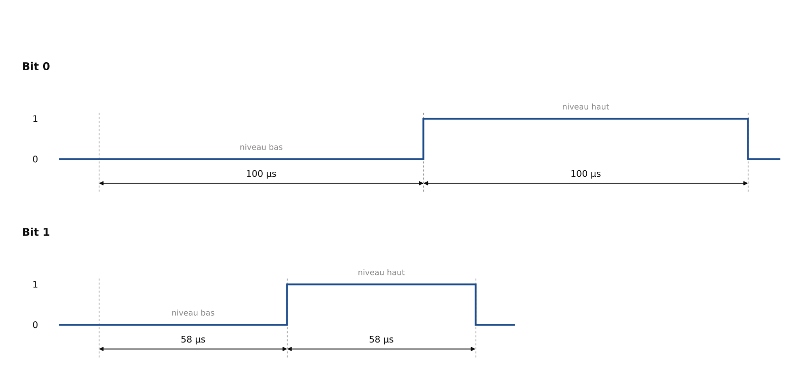
*Chronogrammes théoriques des bits DCC selon la norme NMRA S-9.1 : deux demi-périodes de 100 µs pour le `0` et de 58 µs pour le `1`.*

Le projet est découpé en deux phases :

- **Phase 1, VHDL pur :** la trame est choisie avec les interrupteurs de la carte.
- **Phase 2, SoC MicroBlaze :** les modules du cœur matériel sont réutilisés tels quels dans une IP AXI4-Lite (seul le générateur de trames est remplacé par un wrapper AXI) ; le logiciel C construit les trames et les envoie à l'IP.

## Matériel

Carte Digilent **Basys 3** : FPGA Xilinx Artix-7 XC7A35T, horloge 100 MHz, 16 interrupteurs, boutons poussoirs, LED, port USB pour l'alimentation et la programmation. Le signal DCC sort sur le connecteur PMOD JB et entre dans un booster, qui l'amplifie en courant vers les rails de la maquette.

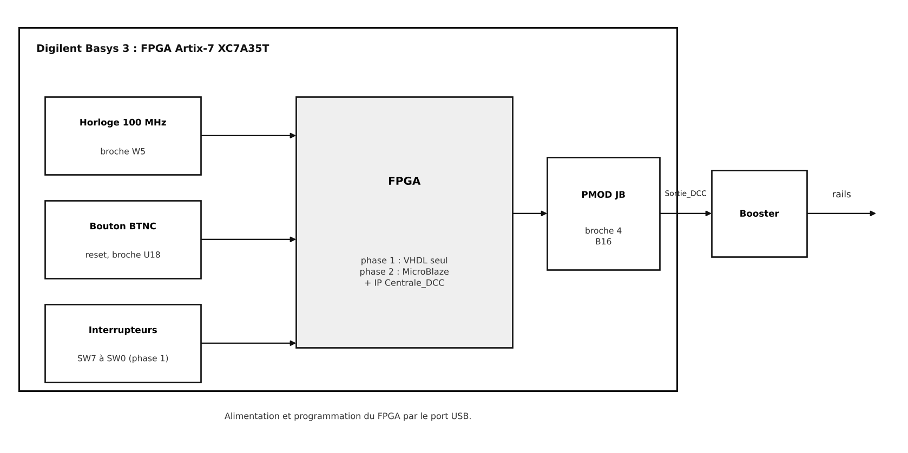
*Éléments de la carte utilisés par le projet et chemin du signal DCC jusqu'aux rails.*

Broches utilisées en phase 1 (fichier `constraints/Top_DCC_phase1.xdc`) :

| Signal | Broche | Élément de la carte |
|---|---|---|
| `CLK_100MHz` | W5 | Horloge 100 MHz |
| `Reset` | U18 | Bouton central (BTNC) |
| `Interrupteur[7]` à `Interrupteur[0]` | W13, W14, V15, W15, W17, W16, V16, V17 | Interrupteurs SW7 à SW0 |
| `Sortie_DCC` | B16 | PMOD JB, broche 4 |

En phase 2, les interrupteurs, les boutons et les LED passent par des GPIO du MicroBlaze et leurs broches viennent des board interfaces de Vivado. Seule `Sortie_DCC_0` (B16) est contrainte à la main (`constraints/Systeme_DCC_phase2.xdc`).

## Architecture

### Phase 1 : cœur matériel

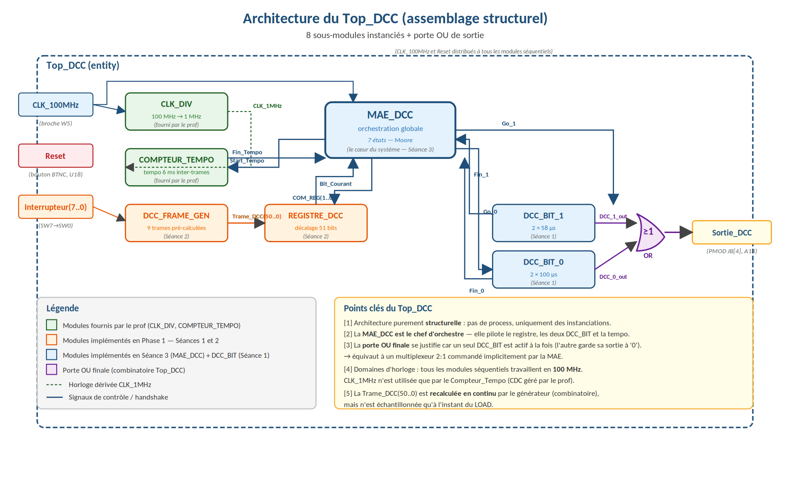
*Architecture structurelle du cœur (COEUR_DCC) : le bloc ≥ 1 fusionne les sorties des deux générateurs de bits, qui ne sont jamais actifs en même temps. En phase 1, le Top_DCC ajoute le générateur de trames devant ce cœur.*

| Module | Rôle |
|---|---|
| `DCC_Bit_0`, `DCC_Bit_1` | Génèrent un bit DCC. Machine de Moore 4 états + compteur de µs, handshake `Go`/`Fin`. |
| `Registre_DCC` | Registre à décalage 51 bits, chargement parallèle, sortie MSB en premier. |
| `MAE_DCC` | Machine à états globale, 7 états (patron 3 process). Séquence LOAD → lecture bit → génération → décalage (×50 après la première lecture, soit 51 bits émis) → tempo 6 ms. |
| `Clk_Div`, `Compteur_Tempo` | Base de temps 1 µs et temporisation inter-trames. |
| `Generateur_Trames` | Phase 1 uniquement : 9 trames pré-calculées sélectionnées par les interrupteurs. |

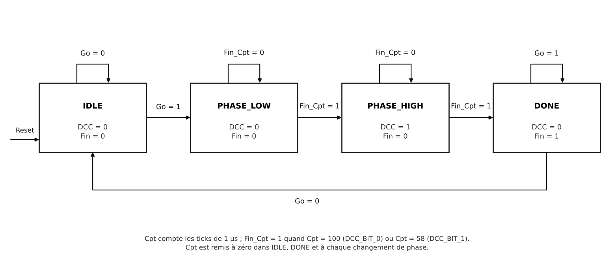
*Machine de Moore à 4 états partagée par DCC_BIT_0 et DCC_BIT_1. Le code actuel compare le compteur à 100 (bit `0`) et à 58 (bit `1`) ; la version d'origine comparait à 99 et à 57 (voir « Corrections apportées après le rendu »).*

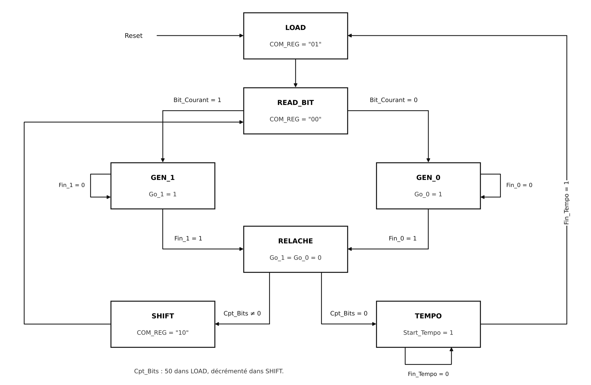
*MAE globale, machine de Moore à 7 états cadencée à 100 MHz : LOAD → READ_BIT → GEN_x → RELACHE → SHIFT, répété jusqu'au 51e bit (50 décalages après la première lecture), puis TEMPO (6 ms).*

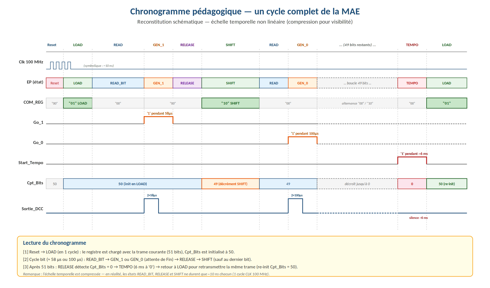
*Reconstitution schématique d'un cycle complet de la MAE : premier bit du préambule, un bit de start `0`, puis dernier bit (stop). L'échelle de temps n'est pas linéaire.*

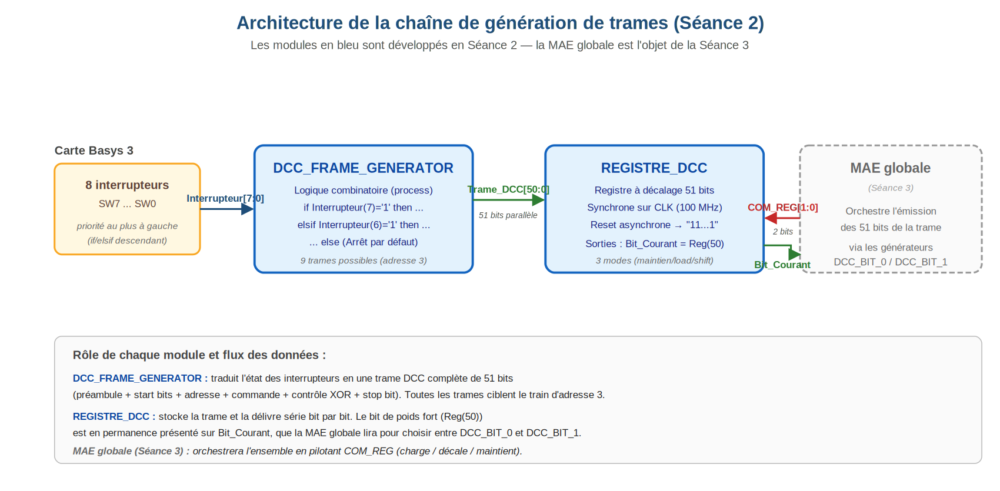
*Chaîne de génération des trames (Phase 1) : les 8 interrupteurs alimentent le générateur, dont la sortie 51 bits est chargée dans le registre piloté par la MAE.*

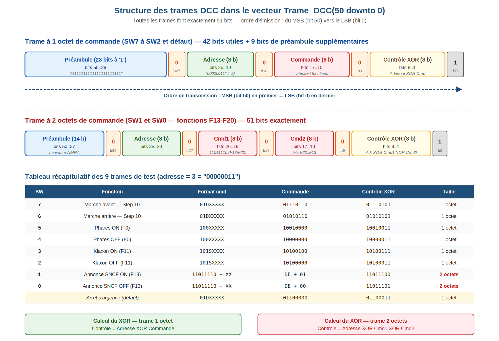
*Structure binaire des trames à 1 et 2 octets de commande dans le vecteur `Trame_DCC(50 downto 0)`.*

Les 9 trames de la phase 1, pour le train d'adresse 3 (octet de commande, octet de contrôle, trame en hexadécimal) :

| Interrupteur | Commande | Octet de commande | Octet de contrôle | Trame (51 bits) |
|---|---|---|---|---|
| SW7 | Marche avant, cran 10 | `01110110` | `01110101` | `7FFFFF019D8EB` |
| SW6 | Marche arrière, cran 10 | `01010110` | `01010101` | `7FFFFF01958AB` |
| SW5 | Phares ON (F0) | `10010000` | `10010011` | `7FFFFF01A4127` |
| SW4 | Phares OFF (F0) | `10000000` | `10000011` | `7FFFFF01A0107` |
| SW3 | Klaxon ON (F11) | `10100100` | `10100111` | `7FFFFF01A914F` |
| SW2 | Klaxon OFF (F11) | `10100000` | `10100011` | `7FFFFF01A8147` |
| SW1 | Annonce F13 ON | `11011110` `00000001` | `11011100` | `7FFE036F005B9` |
| SW0 | Annonce F13 OFF | `11011110` `00000000` | `11011101` | `7FFE036F001BB` |
| aucun | Arrêt (par défaut) | `01100000` | `01100011` | `7FFFFF01980C7` |

### Phase 2 : intégration MicroBlaze

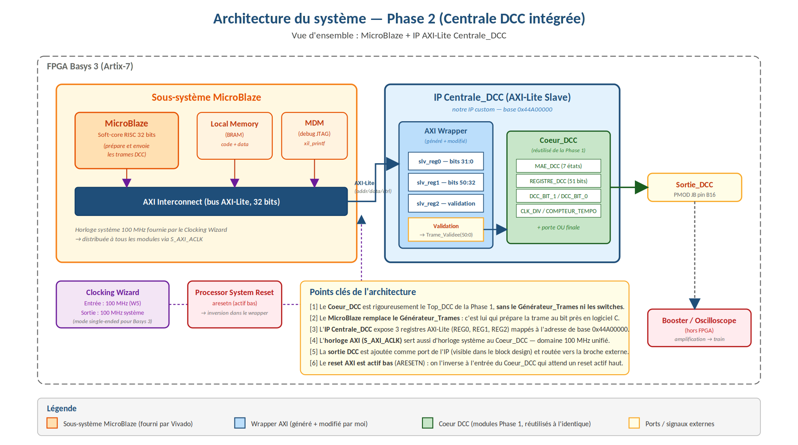
*Après refactorisation : l'ancien Top_DCC devient Coeur_DCC et s'instancie dans un wrapper AXI-Lite exposant trois registres écrits par le MicroBlaze.*

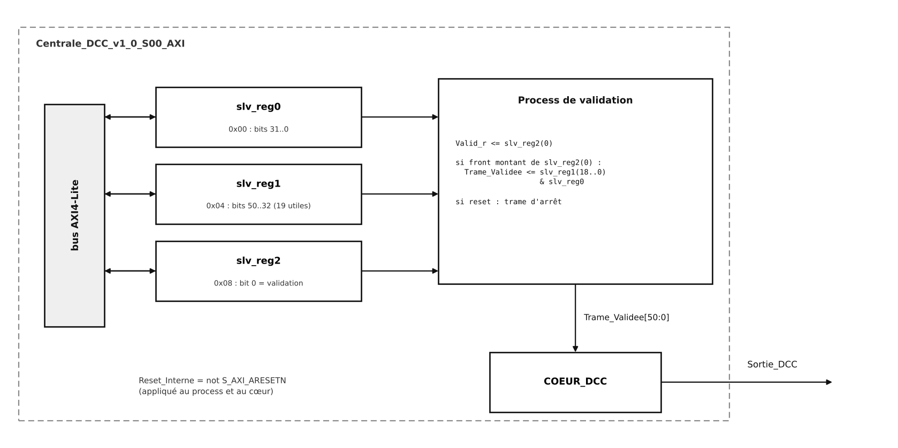
*Wrapper AXI-Lite : décodage d'adresse fourni par Vivado, trois registres, process de validation et instanciation du cœur. Dans la version actuelle, la validation se fait sur le front montant de `REG2(0)` (voir « Corrections apportées après le rendu »).*

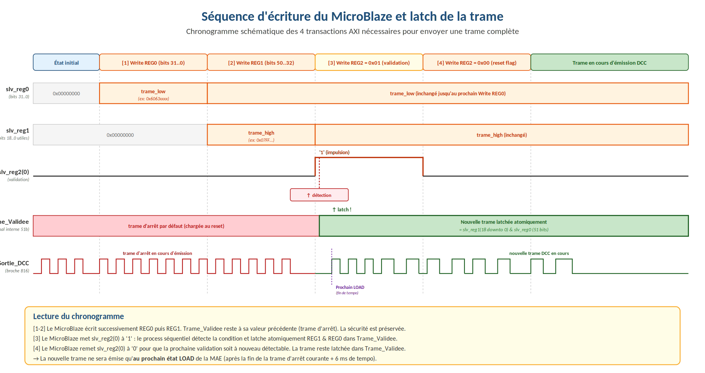
*Séquence d'envoi côté matériel : les quatre écritures AXI sont très courtes devant la durée d'une trame ; le cœur ne voit la nouvelle trame qu'au front montant de `slv_reg2(0)`.*

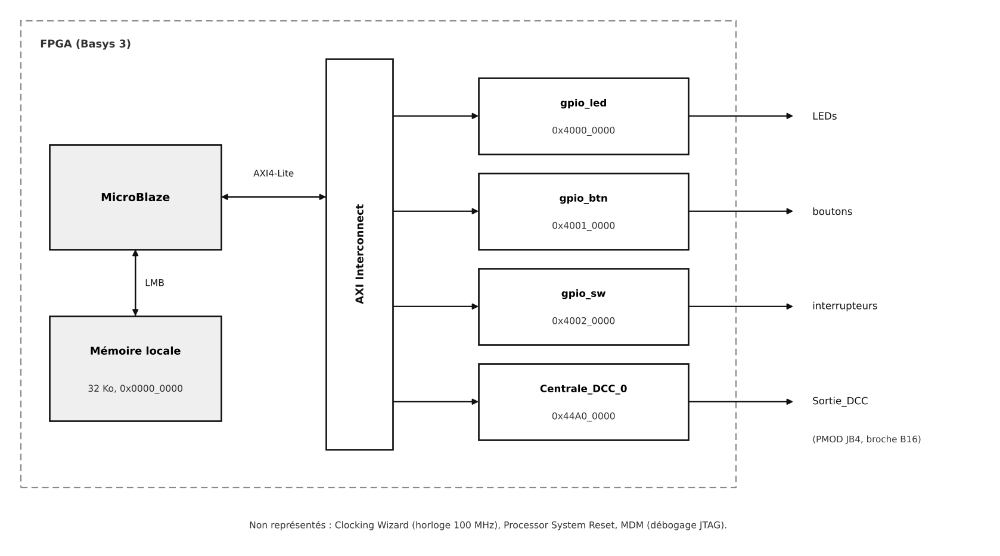
*Système MicroBlaze complet : processeur, mémoire locale, périphériques GPIO et IP DCC reliés par le bus AXI-Lite.*

- **IP `Centrale_DCC`** : 3 registres AXI4-Lite. `REG0` = bits 31..0 de la trame, `REG1` = bits 50..32, `REG2(0)` = validation.
- **Système** : MicroBlaze, mémoire locale 32 Ko, 3 AXI GPIO (LEDs, boutons, interrupteurs), IP DCC. Adresse de base de l'IP : `0x44A0_0000`.
- **Logiciel** (`sw/`) : lit les interrupteurs, construit la trame, l'envoie sur appui de BTNU.

#### Construction du block design dans Vivado IP Integrator

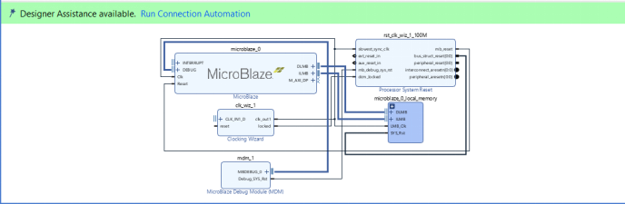
*(a) Après Run Block Automation : sous-système processeur généré (MicroBlaze, mémoire locale, Clocking Wizard, Processor System Reset, MDM).*

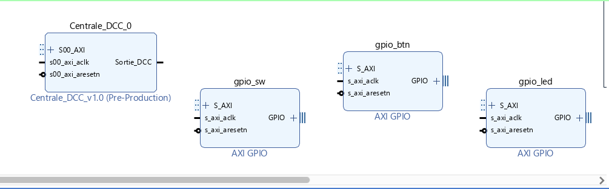
*(b) Les quatre esclaves AXI (Centrale_DCC_0, gpio_sw, gpio_btn, gpio_led) ajoutés depuis l'IP Catalog, pas encore câblés.*

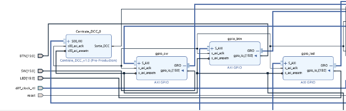
*(c) Après Run Connection Automation : AXI Interconnect inséré, esclaves raccordés ; `Sortie_DCC` externalisé à la main.*

#### Plan d'adressage

Plan d'adressage vu depuis le MicroBlaze (relevé dans l'Address Editor ci-dessous) :

| Périphérique | Adresse de base | Plage |
|---|---|---|
| `Centrale_DCC_0` | `0x44A0_0000` | 64 Ko |
| `gpio_led` | `0x4000_0000` | 64 Ko |
| `gpio_btn` | `0x4001_0000` | 64 Ko |
| `gpio_sw` | `0x4002_0000` | 64 Ko |
| Mémoire locale | `0x0000_0000` | 32 Ko |

Registres de l'IP `Centrale_DCC` (`XPAR_CENTRALE_DCC_0_S00_AXI_BASEADDR` = `0x44A0_0000`) :

| Registre | Offset | Rôle |
|---|---|---|
| `REG0` | `0x00` | bits 31..0 de la trame |
| `REG1` | `0x04` | bits 50..32 de la trame (19 bits utiles) |
| `REG2` | `0x08` | bit 0 : validation |
| `REG3` | `0x0C` | non utilisé (Vivado impose 4 registres) |

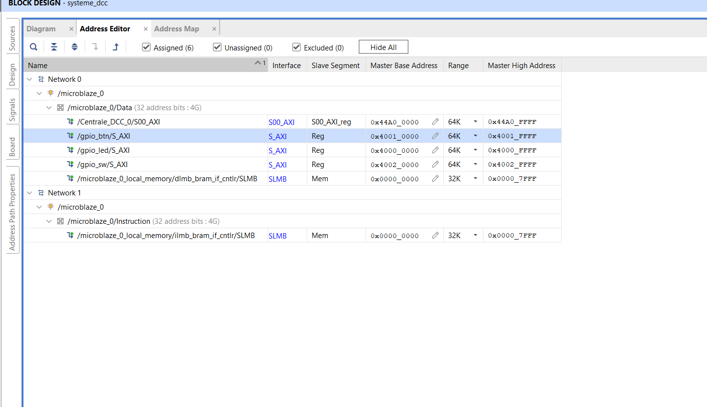
*Address Editor de Vivado : 6 entrées assignées, 0 non assignée.*

#### Logiciel

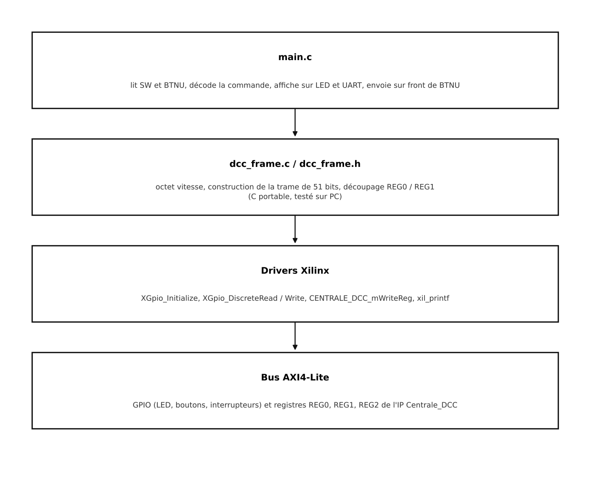
*Architecture logicielle en couches : `main.c` appelle les drivers Xilinx, qui accèdent aux registres AXI-Lite.*

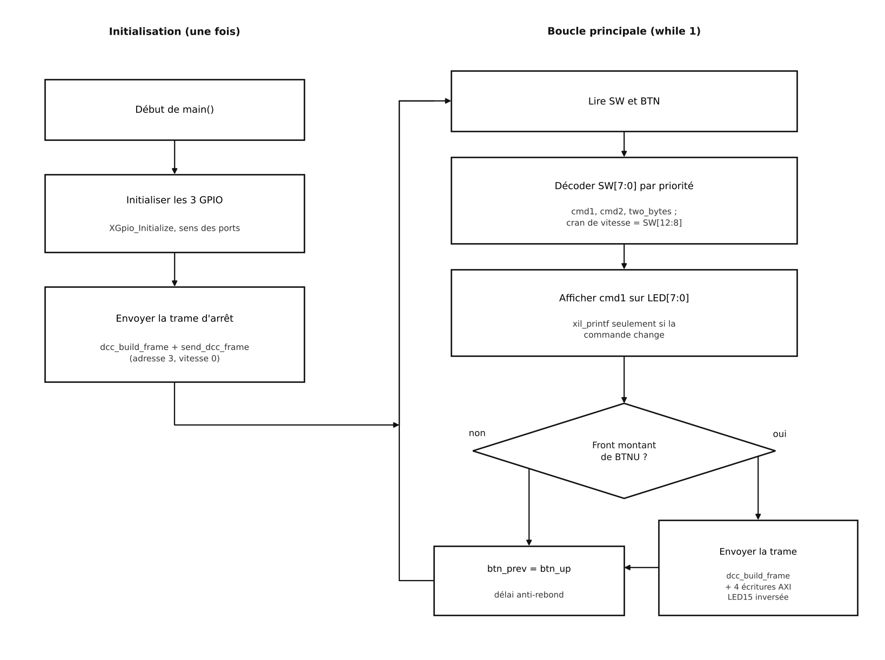
*Organigramme de `main.c` : initialisation (trame d'arrêt de sécurité), puis boucle de lecture, décodage, affichage et envoi sur front montant de BTNU.*

Séquence d'envoi d'une trame (`send_dcc_frame` dans `sw/main.c`) :

| Étape | Appel C | Effet dans l'IP |
|---|---|---|
| 1 | `CENTRALE_DCC_mWriteReg(DCC_BASE_ADDR, DCC_REG0_OFFSET, trame_low)` | `REG0` reçoit les bits 31..0 |
| 2 | `CENTRALE_DCC_mWriteReg(DCC_BASE_ADDR, DCC_REG1_OFFSET, trame_high)` | `REG1` reçoit les bits 50..32 |
| 3 | `CENTRALE_DCC_mWriteReg(DCC_BASE_ADDR, DCC_REG2_OFFSET, 0x00000001)` | front montant de `REG2(0)` : la trame est copiée dans `Trame_Validee` |
| 4 | `CENTRALE_DCC_mWriteReg(DCC_BASE_ADDR, DCC_REG2_OFFSET, 0x00000000)` | la validation est réarmée pour le prochain envoi |

## Choix de conception

**Un seul domaine d'horloge (100 MHz).** Au début, mes compteurs tournaient sur l'horloge 1 MHz générée par la logique. Le reset envoyé par la machine à états (100 MHz) pouvait être raté jusqu'au front 1 MHz suivant, et j'obtenais des impulsions d'environ 10 ns au lieu de 100 µs. Maintenant tous les compteurs sont sur 100 MHz, et le signal 1 MHz ne sert plus que de tick : je détecte son front, ce qui donne un signal d'enable d'un cycle.

**Validation de la trame.** Le MicroBlaze écrit `REG0` puis `REG1`, et entre les deux écritures la trame est incohérente. Le cœur ne prend donc la nouvelle trame qu'au front montant de `REG2(0)`, et il continue d'émettre l'ancienne en attendant. Une écriture pendant l'émission ne peut pas casser la trame en cours : le registre à décalage ne se recharge qu'à l'état LOAD, après la temporisation. La nouvelle trame part au cycle suivant, sans signal « occupé ».

**Trame d'arrêt au reset.** Au reset, l'IP émet une trame d'arrêt pour l'adresse 3, tant que le logiciel n'a rien validé. Le train ne reçoit donc aucun ordre de marche avant la première validation.

**Matériel et logiciel.** Le matériel gère tout le temps réel (microsecondes, préambule, décalage, temporisation). Le C se contente de produire 51 bits, sans contrainte de temps réel. Ajouter une commande ne demande donc pas de nouvelle synthèse.

## Vérification

### Simulation

```bash
./sim/run_sim.sh      # nécessite GHDL
```

| Testbench | Ce qui est vérifié |
|---|---|
| `TB_DCC_Bit_0`, `TB_DCC_Bit_1` | Repos après reset, niveau de chaque phase, handshake `Go`/`Fin`, réactivation (assertions) |
| `TB_Registre_DCC` | Chargement, 51 décalages, ordre MSB → LSB |
| `TB_Generateur_Trames` | Les 9 trames bit à bit (assertions) |
| `TB_Top_DCC_Auto` | **Système complet, auto-vérifiant** : décode `Sortie_DCC` comme un décodeur, vérifie le timing NMRA S-9.1 de chaque demi-période et compare chaque trame à une trame attendue calculée indépendamment |
| `TB_Centrale_DCC_AXI` | **IP complète via de vraies transactions AXI4-Lite** : trame d'arrêt au reset, absence d'effet sans validation, validation sur front, robustesse si le flag reste à 1 |
| `sw/test/test_dcc_frame.c` | Tests unitaires du C sur PC : le logiciel produit exactement les trames du VHDL de la Phase 1 (18 tests) |

```bash
cd sw/test && gcc -Wall -Wextra -I.. test_dcc_frame.c ../dcc_frame.c -o test && ./test
```

#### Captures de simulation Vivado (version d'origine)

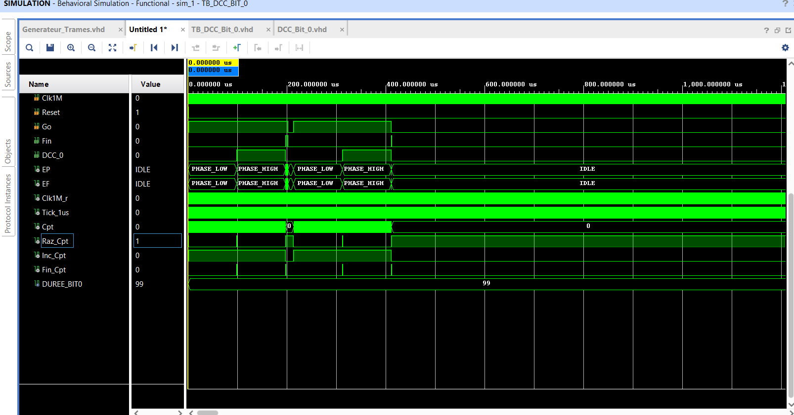
*TB_DCC_BIT_0 : deux émissions successives d'un bit `0`, handshake Go/Fin et retour en IDLE.*

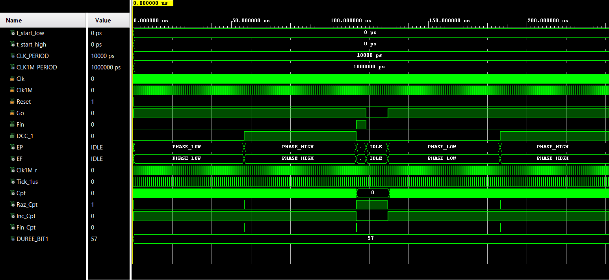
*TB_DCC_BIT_1 : phases mesurables au curseur, `Tick_1us` = une impulsion d'un cycle à chaque front de l'horloge 1 MHz.*

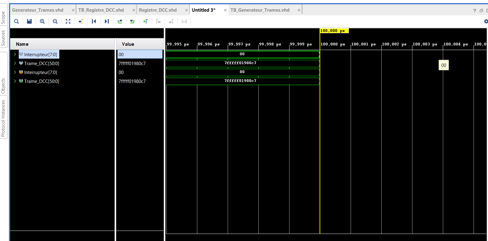
*TB_Generateur_Trames : chaque interrupteur est basculé et la trame vérifiée par assertions (arrêt par défaut = `7FFFFF01980C7`).*

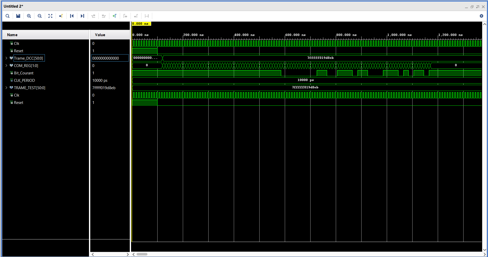
*TB_Registre_DCC : reset → chargement → 51 décalages de la trame `7FFFFF019D8EB` (marche avant, cran 10, adresse 3).*

Ces captures montrent la version d'origine (constantes 57/99). Les valeurs actuelles sont vérifiées par le script GHDL ci-dessus.

### Compilation du firmware (Vitis)

Procédure générique, non rejouée avec la version actuelle du code.

1. Dans Vivado (Phase 2) : *File → Export → Export Hardware*, bitstream inclus → fichier `.xsa`.
2. Dans Vitis : *Create Platform Project* à partir du `.xsa` (OS `standalone`, processeur `microblaze_0`).
3. *Create Application Project* sur cette plateforme, modèle *Empty Application (C)*.
4. Copier `sw/main.c`, `sw/dcc_frame.c` et `sw/dcc_frame.h` dans `src/`, puis *Build*.
5. *Run As → Launch on Hardware* (carte reliée en USB-JTAG) ; la console UART affiche les commandes envoyées.

Sous Vivado 2020.2, si la compilation du driver de l'IP échoue, remplacer le joker `*.o` par `$(OUTS)` dans le Makefile du driver.

### Reconstruction du projet Vivado (Phase 1)

```bash
vivado -mode batch -source build_phase1.tcl
```

Le script crée le projet, lance synthèse, implémentation et bitstream, et écrit les rapports de timing et d'utilisation dans `build/vivado_phase1/`. Il n'a pas été exécuté (voir « Limites »).

### Résultats

| Indicateur | Valeur |
|---|---|
| Demi-période bit `1` / bit `0` (simulation GHDL, version actuelle) | 58,00 µs / 100,00 µs (NMRA S-9.1, émetteur : 55–61 µs / 95–9900 µs) |
| Validation matérielle (version d'origine) | Phase 1 : oscilloscope sur PMOD JB4 (B16) et pilotage du train. Phase 2 : programme C lancé depuis Vitis, console UART et pilotage du train |

Résultats Vivado 2020.2 de la version d'origine, horloge 100 MHz, contraintes de timing respectées dans les deux cas :

| Indicateur | Phase 1 (`TOP_DCC`) | Phase 2 (`systeme_dcc_wrapper`) |
|---|---|---|
| Worst Negative Slack | +6,342 ns | +1,843 ns |
| Worst Hold Slack | +0,147 ns | +0,056 ns |
| Slice LUTs | 104 (0,50 %) | 1 656 (7,96 %) |
| Slice registers | 101 (0,24 %) | 1 881 (4,52 %) |
| Block RAM | 0 | 8 tuiles (16 %) |
| Latches | 0 | 0 |

Source : rapports Vivado des runs du 3 avril 2026 (phase 1) et du 10 avril 2026 (phase 2), extraits dans `docs/reports/`. L'absence de latch s'appuie sur le rapport de timing (0 boucle de latch combinatoire) et sur le journal de synthèse (aucun avertissement). Ces runs précèdent la version actuelle du code. La validation matérielle concerne la version d'origine : le dépôt ne contient pas de capture oscilloscope.

## Structure du dépôt

```
LICENSE          licence MIT
rtl/core/        cœur DCC commun aux deux phases
rtl/phase1/      top VHDL pur + générateur de trames par interrupteurs
ip/Centrale_DCC/ wrapper AXI4-Lite (squelette Vivado + logique utilisateur)
sim/             testbenches + script GHDL
constraints/     XDC Phase 1 et Phase 2 (Basys 3)
sw/              application MicroBlaze + construction des trames (C portable)
sw/test/         tests unitaires C sur PC
docs/img/        figures
docs/reports/    extraits des rapports Vivado (timing, utilisation)
build_phase1.tcl reconstruction du projet Vivado de la Phase 1
```

## Corrections apportées après le rendu

Après la remise du projet, j'ai relu tout le code et lancé une simulation automatisée. Voici ce que j'ai corrigé :

- **Marche arrière (C) :** l'octet vitesse partait de `0x60`, qui a déjà le bit de direction à 1, donc la marche arrière envoyait la marche avant. Je suis parti de `0x40` et j'ai ajouté un test unitaire.
- **Durée des bits :** en simulation je mesurais 57 µs et 99 µs, à cause d'une erreur de 1 µs dans la comparaison du compteur (dans la tolérance NMRA). Je suis passé à 58 µs et 100 µs exactes.
- **Validation AXI :** la copie de la trame dépendait du niveau de `REG2(0)` et pas du front. Si le flag restait à 1, une trame partielle pouvait passer. J'ai mis une détection de front, vérifiée par testbench.
- **Vitesse :** le cran 0 à 28 est maintenant converti au format NMRA `CSSSS` (le bit C est le poids faible). Avant, je recopiais les interrupteurs tels quels.
- **Affichage UART :** `xil_printf` n'est plus appelé à chaque tour de boucle, seulement quand la commande change.
- **Portabilité :** l'état `RELEASE` s'appelle maintenant `RELACHE`, parce que `release` est un mot réservé en VHDL-2008. J'ai aussi réécrit `Clk_Div` et `Compteur_Tempo` pour que tout le design reste dans un seul domaine d'horloge.

La suite de simulation (`sim/run_sim.sh`) et les tests C couvrent ces changements.

## Limites

- **La version du dépôt n'a pas tourné sur la carte.** Le train a été piloté avec la version d'origine, en phase 1 (VHDL pur) et en phase 2 (MicroBlaze + C). Les corrections ci-dessus (durée des bits, validation par front, vitesse, marche arrière) sont validées en simulation et par des tests C, rien de plus.
- **Commandes essayées sur le train.** Le klaxon, l'accélération, la décélération et la trame à 2 octets (annonce F13) ont marché. Je n'ai pas noté le détail des autres commandes. Dans la version d'origine, le C envoyait la marche avant quand on demandait la marche arrière (voir plus haut).
- **Modules de base de temps.** Sur la carte, la version d'origine utilisait `Clk_Div` et `Compteur_Tempo` fournis avec le sujet. Le dépôt contient mes versions (mêmes ports), vérifiées seulement en simulation.
- **Phase 2 non reconstructible depuis le dépôt.** Je n'ai pas exporté le block design MicroBlaze (pas de script `write_bd_tcl`). Il n'existe ici que sous forme de captures dans `docs/img/`. Seule la phase 1 a un script de reconstruction.
- **`build_phase1.tcl` n'a jamais été exécuté.** Je l'ai écrit après le rendu du projet.
- **Matériel non noté.** Je n'ai pas noté le modèle de booster, le tracé de voie ni la locomotive.
- **Silence de 6 ms entre deux trames.** Pendant la temporisation, `Sortie_DCC` reste à 0 : le booster applique donc une tension continue aux rails pendant 6 ms. La norme S-9.2 demande au moins 5 ms entre deux paquets pour la même adresse, mais prévoit de remplir cet intervalle avec des bits valides (trames IDLE ou d'autres adresses). Le décodeur du labo l'a toléré ; un décodeur plus strict pourrait ne pas le faire.
- **Firmware.** Je n'ai pas vérifié la compilation de `sw/main.c` avec la chaîne Xilinx pour la version actuelle. Seul `dcc_frame.c` est compilé et testé sur PC.

## Améliorations possibles

- Synchroniser le bouton de reset (actuellement asynchrone direct).
- Adresse du train configurable (fixée à 3).
- Émission de trames IDLE et répétition des commandes, conformément à S-9.2.
- Bouton de validation traité par interruption plutôt que par scrutation.

## Crédits

Projet de l'UE FPGA1 (MU4IN108), M1 SYSCOM, Sorbonne Université.

J'ai fait tout le projet seul : le VHDL, l'intégration MicroBlaze, le code C, la simulation et les essais sur la carte. J'ai aussi écrit presque tout le compte-rendu. Il a été rendu en binôme et mon binôme l'a relu. Je ne le publie pas ici.

Le projet se rendait dans un seul dépôt pour le binôme, donc les deux noms figuraient dans les fichiers, comme l'enseignant le demandait. Ici, les fichiers ne portent que mon nom.

Le sujet fournissait les interfaces et la structure du projet, ainsi que deux modules, `Clk_Div` et `Compteur_Tempo`. Je ne les publie pas : le dépôt contient mes propres versions, avec les mêmes ports.
