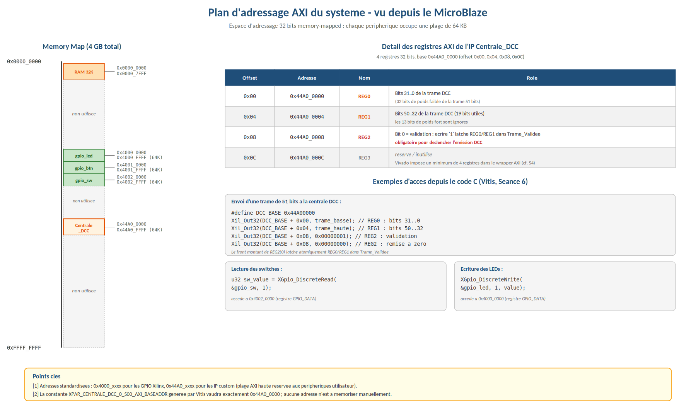
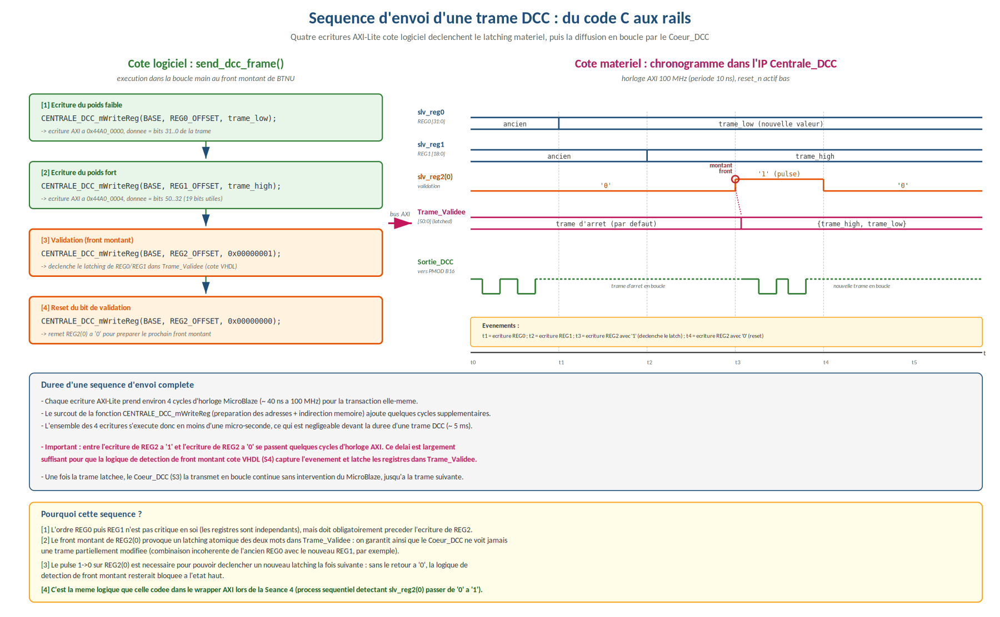

# Centrale DCC sur FPGA — Basys 3 (Artix-7)

Centrale de commande numérique **DCC** (*Digital Command Control*, normes NMRA S-9.1 / S-9.2) pour trains miniatures, conçue en **VHDL** puis intégrée comme **IP AXI4-Lite** dans un système **MicroBlaze** piloté en **C bare-metal**. Validée sur la maquette ferroviaire du laboratoire.

| | |
|---|---|
| **Cible** | Digilent Basys 3 — Xilinx Artix-7 XC7A35T |
| **Outils** | Vivado 2020.2, Vitis, GHDL (simulation) |
| **Langages** | VHDL, C |
| **Contexte** | Master 1 SYSCOM, Sorbonne Université — mars à mai 2026 |

---

## Ce que fait le projet

Un bit DCC est codé en durée : un `1` = 58 µs bas + 58 µs haut, un `0` = 100 µs bas + 100 µs haut. La centrale émet en boucle des trames de 51 bits (préambule, adresse, commande sur 1 ou 2 octets, octet de contrôle XOR, bit de stop), séparées de 6 ms. Un booster amplifie le signal vers les rails.


*Chronogrammes théoriques des bits DCC selon la norme NMRA S-9.1 : deux demi-périodes de 100 µs pour le `0` et de 58 µs pour le `1`.*

Le projet est découpé en deux phases :

- **Phase 1 — VHDL pur :** la trame est choisie avec les interrupteurs de la carte.
- **Phase 2 — SoC MicroBlaze :** le cœur matériel est réutilisé **sans modification** dans une IP AXI4-Lite ; le logiciel C construit les trames et les envoie à l'IP.

## Architecture

### Phase 1 — cœur matériel


*Architecture structurelle du Top_DCC : sous-modules instanciés et porte OU finale qui fusionne les sorties mutuellement exclusives des deux générateurs de bits.*

| Module | Rôle |
|---|---|
| `DCC_Bit_0`, `DCC_Bit_1` | Génèrent un bit DCC. Machine de Moore 4 états + compteur de µs, handshake `Go`/`Fin`. |
| `Registre_DCC` | Registre à décalage 51 bits, chargement parallèle, sortie MSB en premier. |
| `MAE_DCC` | Machine à états globale, 7 états (patron 3 process). Séquence LOAD → lecture bit → génération → décalage (×51) → tempo 6 ms. |
| `Clk_Div`, `Compteur_Tempo` | Base de temps 1 µs et temporisation inter-trames. |
| `Generateur_Trames` | Phase 1 uniquement : 9 trames pré-calculées sélectionnées par les interrupteurs. |


*Machine de Moore à 4 états partagée par DCC_BIT_0 et DCC_BIT_1. Les valeurs `Cpt=99` et `Cpt=57` sont celles de la version du TP ; le code actuel compare à 100 et 58 (voir « Corrections apportées après le TP »).*


*MAE globale, machine de Moore à 7 états cadencée à 100 MHz : LOAD → READ_BIT → GEN_x → RELACHE → SHIFT répété 51 fois, puis TEMPO (6 ms).*


*Reconstitution d'un cycle complet de la MAE (échelle compressée).*

> Dans les figures, l'état `RELACHE` s'appelle encore `RELEASE` : il a été renommé car `release` est un mot réservé en VHDL-2008.


*Chaîne de génération des trames (Phase 1) : les 8 interrupteurs alimentent le générateur, dont la sortie 51 bits est chargée dans le registre piloté par la MAE.*


*Structure binaire des trames à 1 et 2 octets de commande dans le vecteur `Trame_DCC(50 downto 0)`, et les 9 trames testées pour l'adresse 3.*

### Phase 2 — intégration MicroBlaze


*Après refactorisation : l'ancien Top_DCC devient Coeur_DCC et s'instancie dans un wrapper AXI-Lite exposant trois registres écrits par le MicroBlaze.*


*Wrapper AXI-Lite : décodage d'adresse fourni par Vivado, trois registres, process de validation et instanciation du cœur. Dans la version actuelle, la validation se fait sur le front montant de `REG2(0)` (voir « Corrections apportées après le TP »).*


*Séquence d'envoi côté matériel : les quatre transactions AXI durent moins d'une microseconde ; le cœur ne voit la nouvelle trame qu'au front montant de `slv_reg2(0)`.*


*Système MicroBlaze complet : processeur, mémoire locale, périphériques GPIO et IP DCC reliés par le bus AXI-Lite.*

- **IP `Centrale_DCC`** : 3 registres AXI4-Lite. `REG0` = bits 31..0 de la trame, `REG1` = bits 50..32, `REG2(0)` = validation.
- **Système** : MicroBlaze, mémoire locale 32 Ko, 3 AXI GPIO (LEDs, boutons, interrupteurs), IP DCC. Adresse de base de l'IP : `0x44A0_0000`.
- **Logiciel** (`sw/`) : lit les interrupteurs, construit la trame, l'envoie sur appui de BTNU.

#### Construction du block design dans Vivado IP Integrator


*(a) Après Run Block Automation : sous-système processeur généré (MicroBlaze, mémoire locale, Clocking Wizard, Processor System Reset, MDM).*


*(b) Les quatre esclaves AXI (Centrale_DCC_0, gpio_sw, gpio_btn, gpio_led) ajoutés depuis l'IP Catalog, pas encore câblés.*


*(c) Après Run Connection Automation : AXI Interconnect inséré, esclaves raccordés ; `Sortie_DCC` externalisé à la main.*

#### Plan d'adressage


*Plan d'adressage AXI vu depuis le MicroBlaze : `XPAR_CENTRALE_DCC_0_S00_AXI_BASEADDR` = `0x44A0_0000`.*


*Address Editor de Vivado : 6 entrées assignées, 0 non assignée.*

#### Logiciel


*Architecture logicielle en couches : `main.c` appelle les drivers Xilinx, qui accèdent aux registres AXI-Lite.*


*Organigramme de `main.c` : initialisation (trame d'arrêt de sécurité), puis boucle de lecture, décodage, affichage et envoi sur front montant de BTNU.*


*Séquence complète d'envoi d'une trame : les quatre écritures AXI-Lite côté logiciel et le chronogramme correspondant dans l'IP.*

## Choix de conception

**Un seul domaine d'horloge (100 MHz).** Dans une première version, les compteurs tournaient sur l'horloge 1 MHz générée par logique. La remise à zéro envoyée par la machine à états (100 MHz) pouvait être manquée jusqu'au front 1 MHz suivant, ce qui produisait des impulsions de ~10 ns au lieu de 100 µs. Correction : tous les compteurs sont cadencés à 100 MHz, et le signal 1 MHz ne sert plus que de *tick* (détection de front → signal d'enable d'un cycle).

**Validation atomique de la trame.** Le MicroBlaze écrit `REG0` puis `REG1` : entre les deux, la trame est incohérente. Le cœur ne voit donc la nouvelle trame qu'au **front montant** de `REG2(0)`. Jusque-là, il continue d'émettre l'ancienne trame complète. Une écriture pendant l'émission ne peut pas corrompre la trame en cours : le registre à décalage ne se recharge depuis `Trame_Validee` que dans l'état LOAD, après la temporisation. La nouvelle trame part donc au cycle suivant, sans qu'un signal « occupé » soit nécessaire.

**Trame d'arrêt au reset.** Au reset, l'IP émet une trame d'arrêt pour l'adresse 3 : le train ne peut pas partir tant que le logiciel n'a rien validé.

**Séparation matériel / logiciel.** Le matériel gère tout le temps réel (µs, préambule, décalage, tempo) ; le C ne fait que produire 51 bits. Le logiciel n'a donc aucune contrainte temps réel, et ajouter une commande ne demande pas de re-synthèse.

## Vérification

### Simulation

```bash
./sim/run_sim.sh      # nécessite GHDL
```

| Testbench | Ce qui est vérifié |
|---|---|
| `TB_DCC_Bit_0`, `TB_DCC_Bit_1` | Repos après reset, niveau de chaque phase, handshake `Go`/`Fin`, réactivation (assertions) |
| `TB_Registre_DCC` | Chargement, 51 décalages, ordre MSB → LSB |
| `TB_Generateur_Trames` | Les 9 trames bit à bit (assertions) |
| `TB_Top_DCC_Auto` | **Système complet, auto-vérifiant** : décode `Sortie_DCC` comme un décodeur, vérifie le timing NMRA S-9.1 de chaque demi-période et compare chaque trame à une trame attendue calculée indépendamment |
| `TB_Centrale_DCC_AXI` | **IP complète via de vraies transactions AXI4-Lite** : trame d'arrêt au reset, absence d'effet sans validation, validation sur front, robustesse si le flag reste à 1 |
| `sw/test/test_dcc_frame.c` | Tests unitaires du C sur PC : le logiciel produit exactement les trames du VHDL de la Phase 1 (18 tests) |

```bash
cd sw/test && gcc -Wall -Wextra -I.. test_dcc_frame.c ../dcc_frame.c -o test && ./test
```

#### Captures de simulation Vivado (version du TP)


*TB_DCC_BIT_0 : deux émissions successives d'un bit `0`, handshake Go/Fin et retour en IDLE.*


*TB_DCC_BIT_1 : phases mesurables au curseur, `Tick_1us` = une impulsion d'un cycle à chaque front de l'horloge 1 MHz.*


*TB_Generateur_Trames : chaque interrupteur est basculé et la trame vérifiée par assertions (arrêt par défaut = `7FFFFF01980C7`).*


*TB_Registre_DCC : reset → chargement → 51 décalages de la trame `7FFFFF019D8EB` (marche avant, cran 10, adresse 3).*

Ces captures montrent la version du TP (constantes 57/99). Les valeurs actuelles sont vérifiées par le script GHDL ci-dessus.

### Compilation du firmware (Vitis)

1. Dans Vivado (Phase 2) : *File → Export → Export Hardware*, bitstream inclus → fichier `.xsa`.
2. Dans Vitis : *Create Platform Project* à partir du `.xsa` (OS `standalone`, processeur `microblaze_0`).
3. *Create Application Project* sur cette plateforme, modèle *Empty Application (C)*.
4. Copier `sw/main.c`, `sw/dcc_frame.c` et `sw/dcc_frame.h` dans `src/`, puis *Build*.
5. *Run As → Launch on Hardware* (carte reliée en USB-JTAG) ; la console UART affiche les commandes envoyées.

Sous Vivado 2020.2, si la compilation du driver de l'IP échoue, remplacer le joker `*.o` par `$(OUTS)` dans le Makefile du driver.

### Reconstruction du projet Vivado (Phase 1)

```bash
vivado -mode batch -source build_phase1.tcl
```

Crée le projet, lance synthèse, implémentation et bitstream, et écrit les rapports de timing et d'utilisation dans `build/vivado_phase1/`.

### Résultats

| Indicateur | Valeur |
|---|---|
| Demi-période bit `1` / bit `0` (simulation) | 58,00 µs / 100,00 µs (norme centrale : 55–61 µs / 95–9900 µs) |
| Worst Negative Slack | +1,741 ns à 100 MHz |
| Worst Hold Slack | +0,032 ns |
| Latches inférés | 0 |
| Validation matérielle | Oscilloscope sur PMOD JB4 (B16), puis pilotage du train sur la maquette |

## Structure du dépôt

```
rtl/core/        cœur DCC commun aux deux phases
rtl/phase1/      top VHDL pur + générateur de trames par interrupteurs
ip/Centrale_DCC/ wrapper AXI4-Lite (squelette Vivado + logique utilisateur)
sim/             testbenches + script GHDL
constraints/     XDC Phase 1 et Phase 2 (Basys 3)
sw/              application MicroBlaze + construction des trames (C portable)
sw/test/         tests unitaires C sur PC
docs/img/        figures
build_phase1.tcl reconstruction du projet Vivado de la Phase 1
```

## Corrections apportées après le TP

Évolutions apportées après la soutenance, à la suite d'une relecture complète du code et d'un passage en simulation automatisée :

- **Marche arrière (C) :** l'octet vitesse partait de `0x60`, qui a déjà le bit de direction à 1. La marche arrière envoyait donc la marche avant. Corrigé (base `0x40`) et couvert par un test unitaire.
- **Durée des bits :** la mesure en simulation donnait 57 µs / 99 µs (erreur de 1 µs sur la comparaison du compteur, dans la tolérance NMRA). Corrigé à 58 µs / 100 µs exactes.
- **Validation AXI :** la copie de la trame était sensible au *niveau* de `REG2(0)`, et non au front. Si le flag restait à 1, une trame partielle pouvait passer. Corrigé par détection de front et vérifié par testbench.
- **Vitesse :** le cran 0–28 est maintenant converti au format NMRA `CSSSS` (bit C = poids faible), au lieu d'être recopié brut depuis les interrupteurs.
- **Affichage UART :** `xil_printf` n'est plus appelé à chaque tour de boucle, seulement quand la commande change.
- **Portabilité :** l'état `RELEASE` a été renommé `RELACHE` (mot réservé en VHDL-2008). `Clk_Div` et `Compteur_Tempo` ont été réécrits pour que tout le design soit dans un seul domaine d'horloge.

Ces évolutions sont couvertes par la suite de simulation (`sim/run_sim.sh`) et par les tests unitaires C.

## Limites et améliorations possibles

- Synchroniser le bouton de reset (actuellement asynchrone direct).
- Adresse du train configurable (fixée à 3).
- Émission de trames IDLE et répétition des commandes, conformément à S-9.2.
- Bouton de validation traité par interruption plutôt que par scrutation.

## Crédits

Projet de TP réalisé en binôme dans le cadre de l'UE FPGA1 (Sorbonne Université). Conception VHDL, intégration MicroBlaze, développement logiciel et validation : **Mohand CHABANE CHAOUCHE**. Les modules de base de temps fournis avec le sujet ont été remplacés par une réécriture personnelle.
